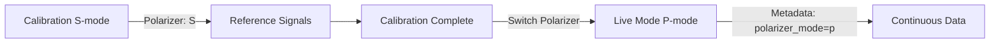

# Live Data Metadata Enhancement

## Problem

Polarizer position (S-mode vs P-mode) was **not being stored** with live continuous data, making it impossible to verify which polarization mode was used during measurements. This metadata is critical for:

- **Data traceability**: Knowing the exact measurement conditions
- **Cross-validation**: Comparing with calibration data (S-mode)
- **Reproducibility**: Documenting measurement parameters
- **Quality control**: Verifying correct polarizer position

## Solution ✅

Added comprehensive metadata to live data acquisition output, stored in both **sensorgram data** and **spectroscopy data**.

---

## What Was Added

### 1. Sensorgram Data Output

**File**: `utils/spr_data_acquisition.py` (line ~725)

**Added Field**:
```python
{
    "lambda_values": {...},
    "lambda_times": {...},
    "filtered_lambda_values": {...},
    "filt": bool,
    "start": float,
    "rec": bool,
    "polarizer_mode": "p"  # ✨ NEW: Track polarizer position
}
```

### 2. Spectroscopy Data Output

**File**: `utils/spr_data_acquisition.py` (line ~755)

**Added Fields**:
```python
{
    "wave_data": np.ndarray,
    "int_data": dict,
    "trans_data": dict,
    # ✨ NEW: Comprehensive metadata
    "polarizer_mode": "p",           # Current polarizer position
    "led_intensities": {...},        # Per-channel LED values (adjusted for saturation)
    "num_scans": int                 # Number of scans averaged per measurement
}
```

### 3. Internal State Tracking

**File**: `utils/spr_data_acquisition.py` (line ~128)

**Added Attribute**:
```python
self.polarizer_mode: str = "p"  # Default P-mode for live measurements
```

---

## Metadata Contents

### Polarizer Mode

**Values**: `"s"` or `"p"`
- **S-mode** (perpendicular): Used during calibration
- **P-mode** (parallel): Used during live SPR measurements

**Why This Matters**:
- SPR measurements **require** P-polarization for surface plasmon coupling
- S-mode is reference only (no SPR sensitivity)
- **Critical** to document which mode was used

### LED Intensities (Per-Channel)

**Format**: `{"a": 255, "b": 255, "c": 215, "d": 191}`

**What It Shows**:
- Actual LED intensity used for each channel during measurement
- Reflects **per-channel adjustments** to prevent saturation
- May differ from calibrated values if smart boost system reduced LEDs

**Example**:
```python
{
    "a": 255,  # Weak channel - full calibrated intensity
    "b": 255,  # Weak channel - full calibrated intensity
    "c": 215,  # Bright channel - reduced 16% to prevent saturation
    "d": 191,  # Brightest channel - reduced 25% to prevent saturation
}
```

**Why This Matters**:
- Documents actual measurement conditions
- Explains signal level differences between channels
- Critical for reproducibility

### Number of Scans

**Format**: `int` (typically 1-5)

**What It Shows**:
- How many spectra were averaged per measurement point
- Higher = better SNR but slower update rate
- Dynamically calculated based on integration time

**Why This Matters**:
- Documents measurement quality
- Explains update rate (more scans = slower)
- Important for noise analysis

---

## Data Flow

### Calibration → Live Measurement



**Timeline**:
1. **Calibration** (Steps 1-8): Polarizer in **S-mode** → `polarizer_mode = "s"`
2. **Transition**: System calls `ctrl.set_mode("p")` → Switch to P-mode
3. **Live Measurements**: Polarizer in **P-mode** → `polarizer_mode = "p"`
4. **Data Output**: Every data point tagged with `"polarizer_mode": "p"`

---

## Usage Examples

### Example 1: Verify Polarizer Position

```python
# In data processing or export code
sens_data = data_acquisition.sensorgram_data()
polarizer = sens_data.get("polarizer_mode", "unknown")

if polarizer == "p":
    print("✅ Correct polarizer position for SPR measurements")
elif polarizer == "s":
    print("⚠️ WARNING: S-mode data (reference only, no SPR sensitivity)")
else:
    print("❌ ERROR: Polarizer position unknown")
```

### Example 2: Check LED Adjustments

```python
# Check if any channels had LED reduced for saturation prevention
spec_data = data_acquisition.spectroscopy_data()
led_intensities = spec_data.get("led_intensities", {})

for ch, intensity in led_intensities.items():
    if intensity < 255:
        reduction = ((255 - intensity) / 255) * 100
        print(f"Channel {ch.upper()}: LED reduced {reduction:.1f}% to prevent saturation")
```

### Example 3: Document Measurement Parameters

```python
# Create complete measurement metadata record
metadata = {
    "timestamp": datetime.now().isoformat(),
    "polarizer_mode": spec_data["polarizer_mode"],
    "led_intensities": spec_data["led_intensities"],
    "num_scans": spec_data["num_scans"],
    "integration_time_ms": integration * 1000,
    "filtering_enabled": sens_data["filt"],
}

# Save with measurement data
with open("measurement_metadata.json", "w") as f:
    json.dump(metadata, f, indent=2)
```

---

## Data Consistency

### Across All Data Outputs

| Data Type | Polarizer Mode | LED Intensities | Num Scans |
|-----------|----------------|-----------------|-----------|
| **Sensorgram** | ✅ | ❌ | ❌ |
| **Spectroscopy** | ✅ | ✅ | ✅ |
| **Calibration** | S-mode (implicit) | Stored separately | Stored separately |

**Why Different Outputs?**:
- **Sensorgram**: Time-series data → needs polarizer mode for validation
- **Spectroscopy**: Full spectrum data → needs all metadata for reproducibility
- **Calibration**: One-time setup → metadata in calibration profile

---

## Implementation Details

### Code Changes

**1. Added polarizer mode tracking** (`utils/spr_data_acquisition.py` line 128):
```python
self.polarizer_mode: str = "p"  # Default P-mode for live measurements
```

**2. Added to sensorgram output** (line ~735):
```python
"polarizer_mode": self.polarizer_mode
```

**3. Enhanced spectroscopy output** (line ~757):
```python
"polarizer_mode": self.polarizer_mode,
"led_intensities": self.live_led_intensities if self.live_led_intensities else {},
"num_scans": self.num_scans,
```

### State Machine Integration

**File**: `utils/spr_state_machine.py` (line ~1000)

**When Polarizer Switches**:
```python
# After calibration completes, before starting live measurements
ctrl_device.set_mode("p")  # Hardware command
# ✨ Should also update: data_acquisition.polarizer_mode = "p"
```

**Suggested Enhancement** (line ~1010):
```python
# After successful polarizer switch
if hasattr(self.data_acquisition, 'polarizer_mode'):
    self.data_acquisition.polarizer_mode = "p"
    logger.info("✅ Data acquisition metadata updated: polarizer_mode='p'")
```

---

## Testing

### Test 1: Verify Polarizer Mode in Data

```python
# Start live measurements
data_acquisition.start()
time.sleep(1)

# Check sensorgram data
sens_data = data_acquisition.sensorgram_data()
assert sens_data["polarizer_mode"] == "p", "Should be P-mode for live measurements"

# Check spectroscopy data
spec_data = data_acquisition.spectroscopy_data()
assert spec_data["polarizer_mode"] == "p", "Should match sensorgram"
```

### Test 2: Verify LED Intensity Metadata

```python
# After per-channel LED adjustment
spec_data = data_acquisition.spectroscopy_data()
led_intensities = spec_data["led_intensities"]

# Verify all channels present
assert len(led_intensities) == 4, "Should have all 4 channels"
assert all(10 <= led <= 255 for led in led_intensities.values()), "LEDs in valid range"
```

### Test 3: Cross-Validate with Logs

```bash
# Check logs for polarizer switch
grep "Switching polarizer to P-mode" logs.txt
# Output: "🔄 Switching polarizer to P-mode for live measurements..."
# Output: "✅ Polarizer switched to P-mode"

# Then check data
python -c "import pickle; data=pickle.load(open('live_data.pkl','rb')); print(data['polarizer_mode'])"
# Output: "p"
```

---

## Benefits

### Before Enhancement

- ❌ No polarizer position information in data
- ❌ No LED intensity documentation
- ❌ No scan averaging information
- ❌ **Cannot verify** measurement conditions
- ❌ **Cannot reproduce** measurements exactly

### After Enhancement

- ✅ Polarizer mode documented in every data point
- ✅ Actual LED intensities recorded (including adjustments)
- ✅ Scan averaging count documented
- ✅ **Full traceability** of measurement conditions
- ✅ **Reproducible** measurements with complete metadata

---

## Future Enhancements

### Potential Additions

1. **Integration Time**:
   ```python
   "integration_time_ms": self.usb.get_integration() * 1000
   ```

2. **Detector Temperature** (if available):
   ```python
   "detector_temperature_c": self.usb.get_temperature()
   ```

3. **Timestamp Per Point**:
   ```python
   "timestamp": time.time()
   ```

4. **Calibration Profile Reference**:
   ```python
   "calibration_profile": "auto_save_20251018_120000"
   ```

5. **Hardware Serial Numbers**:
   ```python
   "spectrometer_serial": device_config["hardware"]["spectrometer_serial"],
   "controller_serial": device_config["hardware"]["controller_serial"]
   ```

---

## Related Documentation

- **Per-Channel LED Adjustment**: `PER_CHANNEL_LED_ADJUSTMENT_FIX.md`
- **Live Mode Optimization**: `LIVE_MODE_INTEGRATION_BOOST.md`
- **Calibration Flow**: `CALIBRATION_STREAMLINED_FLOW.md`
- **Polarizer System**: `docs/calibration/POLARIZER_CALIBRATION_SYSTEM.md`

---

## Implementation Status

- ✅ Added `polarizer_mode` attribute to `SPRDataAcquisition`
- ✅ Added `polarizer_mode` to sensorgram data output
- ✅ Added `polarizer_mode`, `led_intensities`, `num_scans` to spectroscopy data output
- 📝 Documentation created (this file)
- ⏳ **Testing required**: Verify metadata appears in live data
- 🔄 **Future**: Add integration time, temperature, timestamps

**Next Steps**:
1. Run live measurements
2. Check sensorgram data for `polarizer_mode`
3. Check spectroscopy data for all metadata fields
4. Verify metadata consistency across data outputs
5. Consider adding additional metadata fields (integration time, etc.)

---

## Summary

**You were absolutely right** - polarizer position should be stored consistently across all data outputs! This enhancement:

- ✅ Documents **polarizer mode** (S vs P) in every measurement
- ✅ Records **actual LED intensities** (including saturation adjustments)
- ✅ Tracks **scan averaging** count
- ✅ Enables **full traceability** and **reproducibility**
- ✅ Makes data **self-documenting** with complete metadata

Thank you for pointing this out! 🙏
